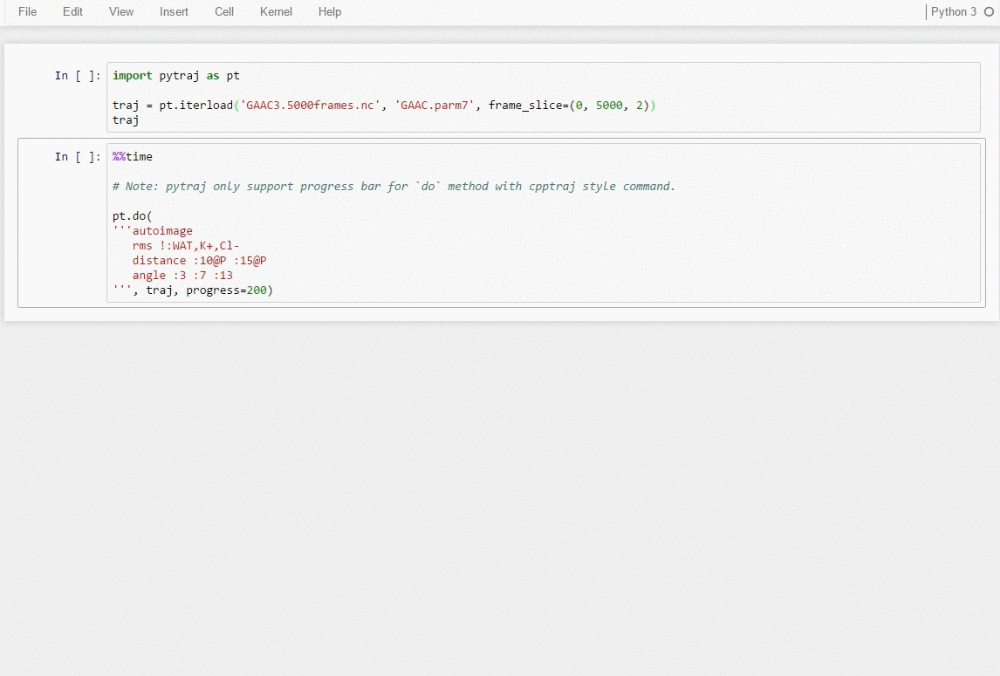

[](https://travis-ci.org/Amber-MD/pytraj)
[](https://anaconda.org/ambermd/pytraj/)
[](https://badge.fury.io/py/pytraj)
[](https://coveralls.io/github/Amber-MD/pytraj?branch=master)
[](http://mybinder.org/repo/hainm/notebook-pytraj)

[](http://amber-md.github.io/pytraj/latest/index.html)

PYTRAJ 
------
A Python front-end of [cpptraj program] (https://github.com/Amber-MD/cpptraj) (a data analysis package for biomolecular simulation).

Website: http://amber-md.github.io/pytraj

* [Features](#features)
* [Install](#install)
* [How to get started?](#how-to-get-started)
* [Contributors and Acknowledgement](#contributors-and-acknowledgement)
* [Citation](#citation)
* [Question/Suggestion?](#questionsuggestion)
* [nglview with pytraj in Jupyter notebook](#nglview-with-pytraj-in-jupyter-notebook)
* [Demo: Interactive data exploration with Jupyter notebook](#demo-interactive-data-exploration-with-jupyter-notebook)
* [License](#license)


Features
--------

- support more than 80 types of data analyses (rmsd, radgyr, autoimage, pca, clustering,...)
- read/write various file formats (.nc, .dcd, .trr, .pdb, .mol2, ...)
- fast (core codes were written in C++ and Cython)
- support parallel calculation with trivial installation (openmp, multiprocessing, mpi, ...)
- interactive analysis with large trajectory data that does not fit to memory
- [>> many more with comprehensive tutorials] (http://amber-md.github.io/pytraj)


Install
-------
Supported platforms: Linux, OSX

- from AMBER suite distribution [http://ambermd.org/](http://ambermd.org/#AmberTools).

- from conda: `conda install -c ambermd pytraj`

- from pip: `pip install pytraj`

- from source code:

    ```bash
    git clone https://github.com/amber-md/pytraj
    cd pytraj

    python setup.py install
 
    # Note: openmp will be turned off in OSX.
    ```

- getting trouble? : [check our webpage](http://amber-md.github.io/pytraj/latest/installation.html)


How to get started?
------------------

- examples: 

    ```python
    import pytraj as pt
    traj = pt.iterload("data.nc", "top.parm7")
    pt.rmsd(traj, mask='@CA', ref=0)
    pt.dssp(traj, mask=':2-16')
    pt.pca(traj, mask='!@H=', n_vecs=2)
    ```
- check our website: [http://amber-md.github.io/pytraj] (http://amber-md.github.io/pytraj)

Contributors and Acknowledgement
--------------------------------

[Please check here](./contributors/)

Citation
--------

If you would like to acknowledge our work, please cite both ``cpptraj`` and ``pytraj`` papers.

something like: 

    "...used pytraj [1], a Python package binding to cpptraj program [2]"

- [1] PYTRAJ: Interactive data analysis for molecular dynamics simulations. Hai Nguyen, Daniel R. Roe, Jason Swails, David A. Case. (2016)

- [2] [PTRAJ and CPPTRAJ] (http://pubs.acs.org/doi/abs/10.1021/ct400341p): Software for Processing and Analysis of Molecular Dynamics Trajectory Data.
Daniel R. Roe and Thomas E. Cheatham, III
Journal of Chemical Theory and Computation 2013 9 (7), 3084-3095 


Question/Suggestion?
--------------------
* code issue and stuff relating directly to `pytraj`, create [Issue](https://github.com/pytraj/pytraj/issues)
* ask question about data analysis in general, send email to [AMBER Mailing List] (http://lists.ambermd.org/mailman/listinfo/amber)

[nglview](https://github.com/arose/nglview) with pytraj in Jupyter notebook
---------------------------------------


Demo: Interactive data exploration with [Jupyter notebook] (http://jupyter.org/)
--------------------------------------------------------------------------------

[](http://amber-md.github.io/pytraj/latest/index.html)


License
-------
GPL v3 (since pytraj is derived work of [cpptraj](https://github.com/Amber-MD/cpptraj/blob/master/LICENSE))

But if you would like to reuse code snippets and pieces independent of cpptraj, I am (Hai) happy to license them (pieces of codes) under 
BSD-2 Clause or whatever you like. Just buzz us.
