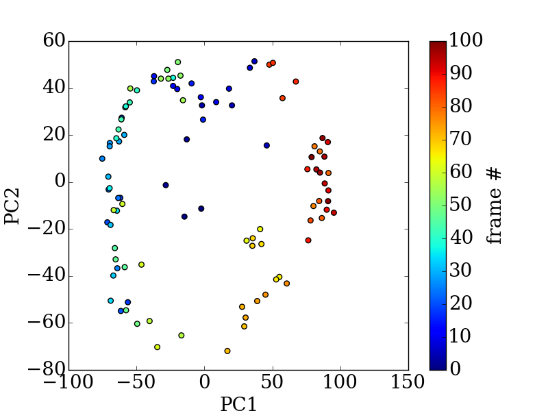
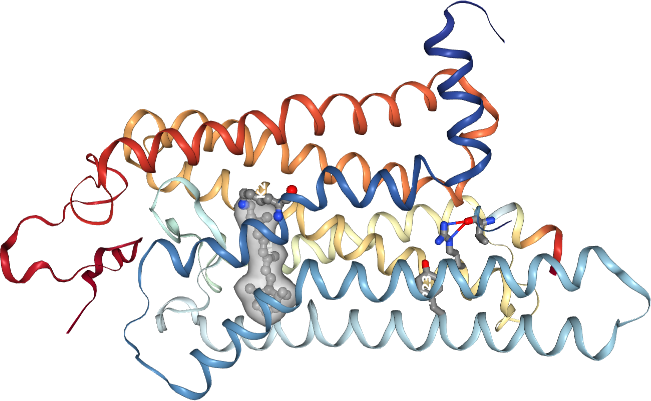

.. pytraj documentation master file, created by
   sphinx-quickstart on Mon Jun 22 19:09:20 2015.
   You can adapt this file completely to your liking, but it should at least
   contain the root `toctree` directive.

.. ipython:: python
    :suppress:

    import numpy as np
    np.set_printoptions(precision=4, suppress=True)

.. raw:: html
    :file: _static/track.html

Welcome
=======

``pytraj`` is a Python front-end of the popular ``cpptraj`` package. Its aim is to expose
``cpptraj``'s funtions to Python's ecosystem. Enjoy.

.. raw:: html

   

   <h2>Overview</h2>

See also

.. toctree::
   :maxdepth: 2

   overview

`AMBER16 users - click me <http://amber-md.github.io/pytraj/release/1.0.4/index.html>`_

`Release versions <http://amber-md.github.io/pytraj/release/>`_

.. raw:: html

   

   

   <h2>Documentation</h2>

.. toctree::
   :maxdepth: 1

   installation
   tutorials/index
   analysis
   cookbook
   read_and_write
   topology
   trajectory
   atom_mask_selection
   parallel
   developer_guide
   misc
   api
   whatsnew
   faq

.. raw:: html

   

   

   <h2>Plot</h2>

|

**Indices and tables**

* `fork and contribute <https://github.com/Amber-MD/pytraj>`_
* :ref:`genindex`
* :ref:`modindex`
* :ref:`search`

.. raw:: html

   

   

   

.. raw:: html

   

   

   <h3><a href=http://jupyter.org/> Jupyter notebook</a></h3>

.. image:: http://jupyter.org/assets/jupyterpreview.png
   :target: http://jupyter.org/
   :height: 200

.. raw:: html

   

   

   <h3><a href=trajectory_viewer.html> Trajectory visualization </a></h3>

.. raw:: html

   

   

   <h3><a href=http://mybinder.org/repo/hainm/notebook-pytraj>Try pytraj online</a></h3>

.. image:: http://mybinder.org/assets/images/logo.svg
   :target: http://mybinder.org/repo/hainm/notebook-pytraj

.. raw:: html

   

